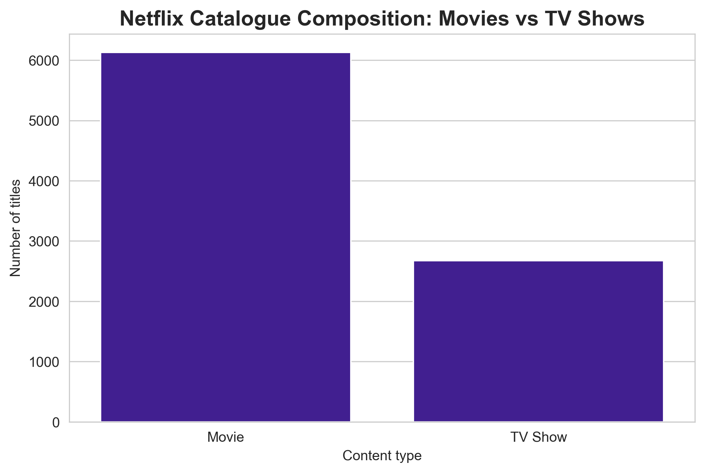
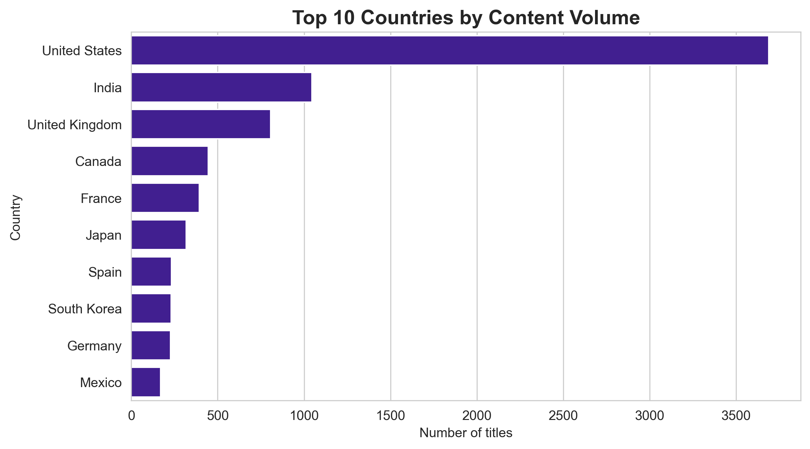
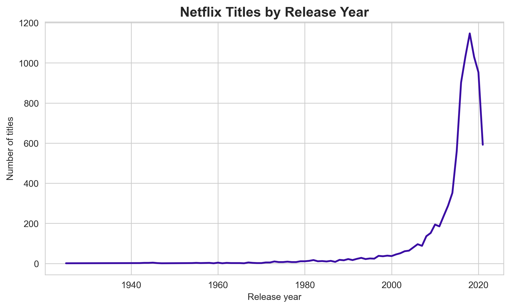
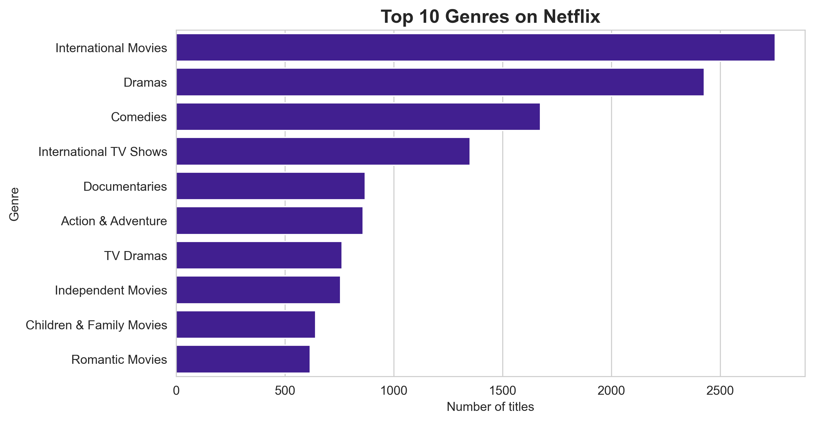
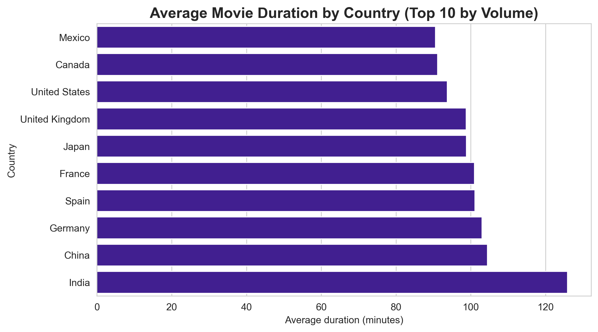

# Netflix Content Strategy — Exploratory Data Analysis

**Author:** Fariba Kazi

## Business Question
**What content strategy does Netflix use across content type, genre, geography, and release timing — and where are the gaps?** Broken into three questions:
1. Is Netflix primarily a movie or TV platform, and which genres dominate its catalogue?
2. Which countries supply the most content, and does format (e.g., movie length) differ by country?
3. How has the volume of content changed across release years?

**Tools:** Python · Pandas · Matplotlib · Seaborn
**Dataset:** [Netflix Movies and TV Shows (Kaggle)](https://www.kaggle.com/datasets/shivamb/netflix-shows)

## Key Findings
1. **Movie-first platform** — Movies make up 6,131 titles (about 70%) vs 2,676 TV shows (about 30%).
2. **US-anchored, globally sourced** — The US leads with 3,690 titles, more than 3× India (1,046), followed by the UK (806).
3. **Recent-content heavy** — Releases climbed sharply after 2015 and peaked in 2018 (1,147 titles).
4. **Drama, comedy & international dominate** — Top genres: International Movies (2,752), Dramas (2,427), Comedies (1,674).
5. **Indian films run longer** — Indian movies average around 126 minutes vs 90–105 minutes elsewhere (the Bollywood effect).

## Visualizations

## Recommendation
Netflix's catalogue is heavily movie-first, US-anchored, and concentrated in recent releases and a few dominant genres (drama, comedy, international). To reduce over-reliance on US content and broaden global appeal, Netflix should deepen investment in under-represented high-growth markets and expand its TV slate, since serialized content tends to drive subscriber retention. The strong presence of "International" genres suggests this global pivot is already underway — and worth accelerating.

## Process
Cleaned missing values, converted dates to datetime, fixed a data bug where movie durations appeared in the rating column, and split multi-value country/genre fields before analysis.

## How to reproduce
1. Download `netflix_titles.csv` from the [Kaggle dataset](https://www.kaggle.com/datasets/shivamb/netflix-shows).
2. Place it in the project folder.
3. Open and run `netflix_content_strategy.ipynb` in Jupyter.

---
*Project by Fariba Kazi · 2026*
