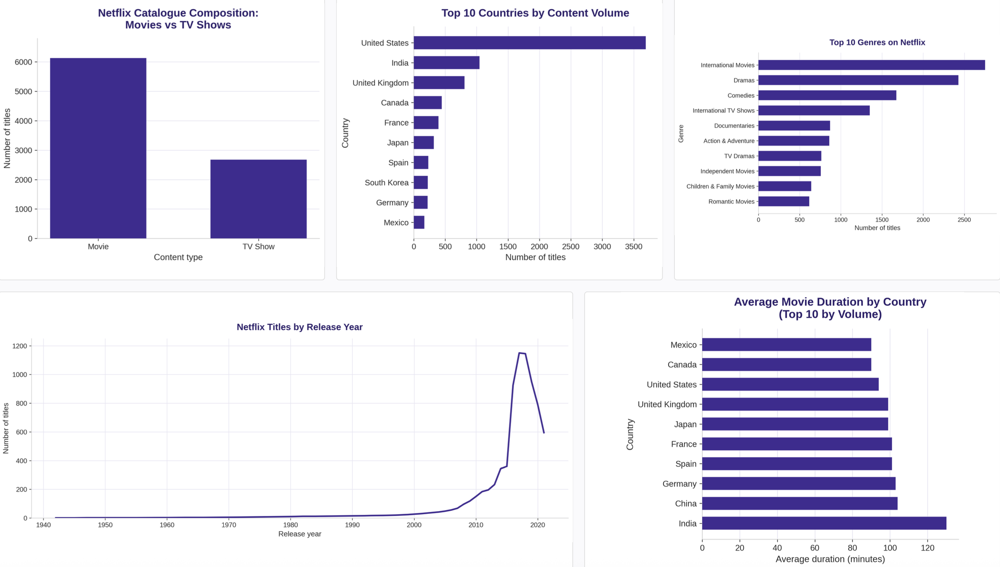

# Netflix Content Strategy — Exploratory Data Analysis
**Personal Portfolio Project**

**Business Question:** What content strategy does Netflix use across content type, genre, geography, and release timing — and where are the gaps?

## Project Overview
An exploratory analysis of 8,807 Netflix titles to understand the platform's catalogue strategy — what it stocks, where its content comes from, and how its library has shifted over time.

## Tools Used
* **Python** (Pandas, Matplotlib, Seaborn) — data cleaning, analysis, visualizations

## Key Findings
* **Movie-first platform** — movies make up 6,131 titles (~70%) vs 2,676 TV shows (~30%)
* **US-anchored, globally sourced** — the US leads with 3,690 titles, more than 3× India (1,046), followed by the UK (806)
* **Recent-content heavy** — releases climbed sharply after 2015 and peaked in 2018 (1,147 titles)
* **Drama, comedy & international dominate** — top genres are International Movies (2,752), Dramas (2,427), and Comedies (1,674)
* **Indian films run longer** — Indian movies average ~126 minutes vs 90–105 minutes elsewhere (the Bollywood effect)

## Process
Cleaned missing values, converted dates to datetime, fixed a data bug where movie durations appeared in the rating column, and split multi-value country and genre fields before analysis.

## Recommendation
Netflix's catalogue is heavily movie-first, US-anchored, and concentrated in recent releases and a few dominant genres. To broaden global appeal and strengthen retention, Netflix should deepen investment in under-represented high-growth markets and expand its TV slate, since serialized content tends to drive subscriber retention.

## Deliverables
* [Jupyter Notebook](https://github.com/faribakazi143/netflix-content-strategy/blob/main/netflix_content_strategy.ipynb)
* Cleaned dataset (CSV)

---
**Author:** Fariba Kazi · [LinkedIn](https://www.linkedin.com/in/fariba-kazi/)
